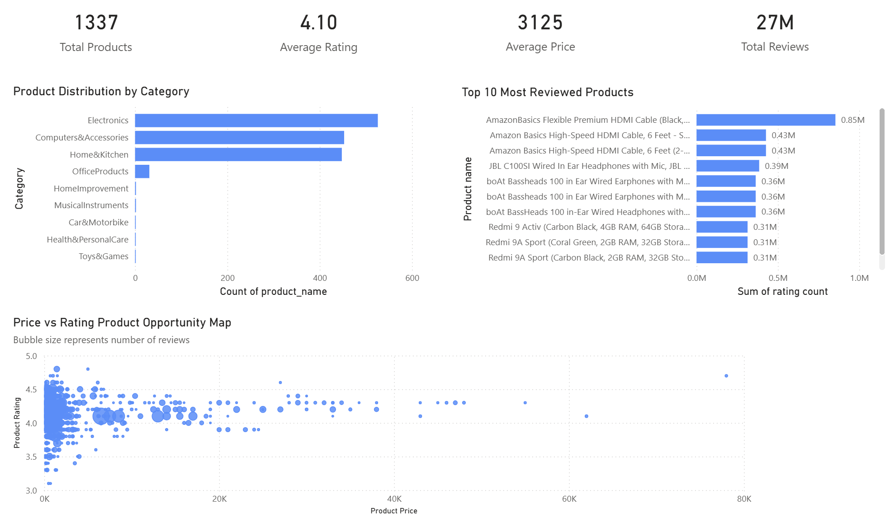

# Amazon Marketplace Product Performance Analysis

Power BI dashboard analysing product performance, pricing behaviour, and review distribution across an Amazon marketplace dataset.

The goal of this project is to demonstrate how business intelligence tools can be used to identify product opportunities, market concentration, and pricing patterns within an e-commerce environment.

---

# Dashboard Overview



---

# Project Objectives

This analysis explores key marketplace questions including:

• Which product categories dominate the marketplace
• Which products attract the most customer attention
• How product price relates to customer ratings
• Where potential product opportunities may exist

The dashboard provides a high-level overview of product performance and market dynamics.

---

# Dataset

The dataset contains **1,337 Amazon marketplace products** and includes:

• Product name
• Category
• Product rating
• Number of customer reviews
• Original price
• Discounted price

This data allows analysis of **pricing behaviour, customer satisfaction, and product popularity**.

---

# Dashboard Components

### Key Metrics

The dashboard highlights four headline metrics:

• Total Products
• Average Product Rating
• Average Product Price
• Total Customer Reviews

These provide a quick overview of the marketplace scale.

---

### Product Distribution by Category

This chart shows the number of products within each category.

Key insight:

Electronics and Computers & Accessories dominate the dataset, indicating a strong focus on consumer electronics products.

---

### Top 10 Most Reviewed Products

This chart identifies products receiving the highest customer engagement.

Key insight:

A small number of products capture extremely large volumes of reviews, demonstrating the **winner-takes-most dynamics** common in online marketplaces.

---

### Price vs Rating Product Opportunity Map

A scatter plot visualising:

• Product price
• Customer rating
• Review volume (bubble size)

Key insight:

Highly rated products appear across a wide range of price levels, suggesting that **price alone does not determine customer satisfaction**.

Large review volumes tend to cluster in lower price ranges, reflecting higher sales volumes for more affordable products.

---

# Tools Used

• **Power BI** – dashboard development and visualisation
• **Power Query** – data preparation
• **DAX** – calculated metrics and analysis

---

# Key Takeaways

• Consumer electronics dominate the marketplace
• A small number of products capture the majority of reviews
• Strong ratings exist across multiple price ranges
• Lower priced products generate the largest review volumes

---

# Repository Contents

```
Amazon_Dashboard.png        Dashboard screenshot
Amazon_Seller_Dashboard.pbix Power BI dashboard file
amazon.csv                  Dataset
```

---

# Author

Sam H
Data Analysis Portfolio
